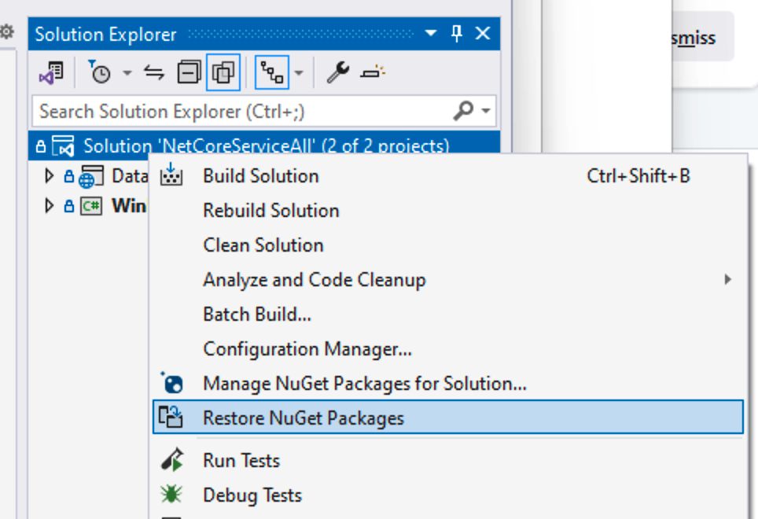
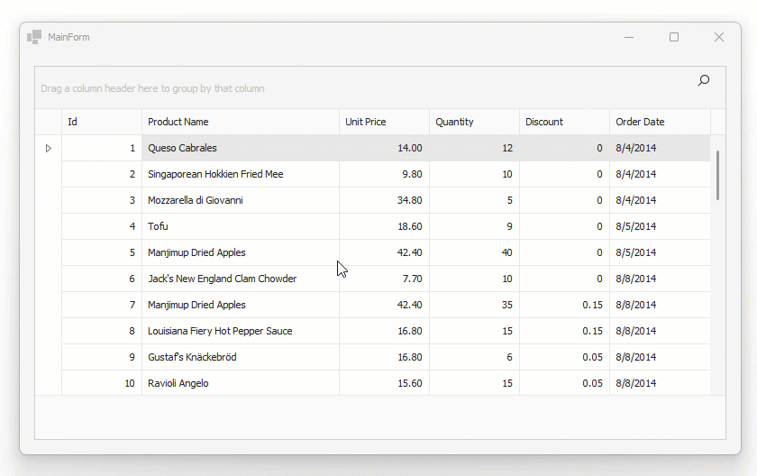

<!-- default badges list -->

[](https://supportcenter.devexpress.com/ticket/details/T1249843)
[](https://docs.devexpress.com/GeneralInformation/403183)
[](#does-this-example-address-your-development-requirementsobjectives)
<!-- default badges end -->
# Connect a WinForms Data Grid to a .NET Core Service

> Please read [the blog post](https://community.devexpress.com/blogs/news/archive/2024/08/21/connect-a-winforms-data-grid-to-a-net-core-service.aspx) for details about this sample.

## Prerequisites

* [Visual Studio 2022 v17.0+](https://visualstudio.microsoft.com/vs/)
* [.NET SDK 8.0+](https://dotnet.microsoft.com/en-us/download/dotnet)
* Download and run our [Unified Component Installer](https://www.devexpress.com/products/try/) or [add your personal DevExpress NuGet feed URL](https://docs.devexpress.com/GeneralInformation/116042/installation/install-devexpress-controls-using-nuget-packages/obtain-your-nuget-feed-url) to Visual Studio NuGet feeds.
    
    > We recommend that you select all products when you run the DevExpress installer. It will register local NuGet package sources and item / project templates. You can uninstall unnecessary components later.


## Getting Started

1.	Open *NetCoreServiceAll.sln*. [Register a DevExpress NuGet feed](https://docs.devexpress.com/GeneralInformation/116698/nuget/setup-visual-studios-nuget-package-manager) in the Visual Studio IDE. Skip this step if you have already registered the DevExpress NuGet feed.
2.	Restore NuGet packages in the solution:

    
3.	Run the **DataService** project. Right-click DataService in the Solution Explorer and select **Debug** | **Start New Instance** in the menu. Your default web browser will open. 
    
    > **IMPORTANT**
    > 
    > Do not close the web browser.
4.  To initialize the sample data when you run the service for the first time, navigate to the URL `http://localhost:5146/api/populateTestData` in the open web browser. You will see the following message: *"Data populated successfully"*.
5.  Run the **WinForms.Client** project. Right-click WinForms.Client in the Solution Explorer and select **Debug** | **Start New Instance** in the menu.
6.  You can scroll to the end of the data list in the grid and observe more data being loaded. You can sort by clicking column headers. The *Output* tool window in Visual Studio displays information about the loading status from both running processes. The animation below shows the result:
    
    

## Implementation Details

### The Backend: an ASP.NET Core WebAPI service using Entity Framework Core

The backend project is called *DataService* and it was created using the standard ASP.NET Core WebAPI template. There are two endpoint handlers in the service, one to generate some test data and the other to query data.

The second handler, at the URL /data/OrderItems, accepts several optional parameters to support the `skip`, `take`, and `sort` features. The code queries data from the Entity Framework Core database context, and uses the standard `IQueryable<T>` based helpers to implement data shaping functionality. The `TotalCount` field is returned together with the data and is used on the client side to determine how much data is available to query.

```csharp
app.MapGet("/data/OrderItems", async (
  DataServiceDbContext dbContext,
  int skip = 0, int take = 20,
  string sortField = "Id", bool sortAscending = true) =>
{
  var source =
    dbContext.OrderItems.AsQueryable()
      .OrderBy(sortField + (sortAscending ? " ascending" : " descending"));
  var items = await source.Skip(skip).Take(take).ToListAsync();

  var totalCount = await dbContext.OrderItems.CountAsync();

  return Results.Ok(new
  {
    Items = items,
    TotalCount = totalCount
  });
});
```

### The Frontend: a Windows Forms app with a DevExpress Data Grid

In the `MainForm` of the Windows Forms application, the DevExpress GridControl control is bound to a `VirtualServerModeSource` instance (a collection of `OrderItem` objects). To fetch data, the VirtualServerModeSource handles the following events:

* `ConfigurationChanged` - Fires when the grid changes some relevant part of its runtime configuration in response to user interaction (for example, when the user clicks a column header to apply sorting).
* `MoreRows` - Fires when an initial fetch operation returns a result, which indicates that more data is available. In this case, the grid attempts to retrieve more data rows if and when the user scrolls to the bottom of the currently loaded set of data.

In this example, data loaded from the backend is encoded as JSON. The type `DataFetchResult` models the structure that is published by the backend endpoint, including the `TotalCount` property:

```csharp
public class DataFetchResult {
  public List<OrderItem> Items { get; set; } = null!;
  public int TotalCount { get; set; }
}
```

The `GetRowsAsync` method handles retrieved data. The method is called both on initial load (from the `ConfigurationChanged` handler) and on further loads (from the `MoreRows` handler). The `HttpClient` is used to retrieve data, passing arguments as URL parameters for skip, take, and sorting properties. Results are deserialized from JSON and returned together with the `moreRowsAvailable` flag:

```csharp
public Task<VirtualServerModeRowsTaskResult>
  GetRowsAsync(VirtualServerModeRowsEventArgs e)
{
  return Task.Run(async () =>
    {
      using var client = new HttpClient();
      var response = await client.GetAsync(
        $"{System.Configuration.ConfigurationManager.AppSettings["baseUrl"]}/data/OrderItems?skip={e.CurrentRowCount}&take={BatchSize}&sortField={SortField}&sortAscending={SortAscending}");
      response.EnsureSuccessStatusCode();
      var responseBody = await response.Content.ReadAsStringAsync();

      var dataFetchResult =
        JsonSerializer.Deserialize<DataFetchResult>(
          responseBody, new JsonSerializerOptions
          {
            PropertyNameCaseInsensitive = true
          });

      if (dataFetchResult is null)
        return new VirtualServerModeRowsTaskResult();

      var moreRowsAvailable =
        e.CurrentRowCount + dataFetchResult.Items.Count < dataFetchResult.TotalCount;

    return new VirtualServerModeRowsTaskResult(
      dataFetchResult.Items, moreRowsAvailable);
  }, e.CancellationToken);
}
```
<!-- feedback -->
## Does this example address your development requirements/objectives?

[](https://www.devexpress.com/support/examples/survey.xml?utm_source=github&utm_campaign=connect-winforms-grid-to-dotnetcore-service&~~~was_helpful=yes) [](https://www.devexpress.com/support/examples/survey.xml?utm_source=github&utm_campaign=connect-winforms-grid-to-dotnetcore-service&~~~was_helpful=no)

(you will be redirected to DevExpress.com to submit your response)
<!-- feedback end -->
